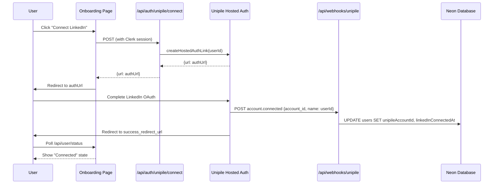

# LinkedIn Connection (Unipile)

## Overview

Enable users to connect their LinkedIn account via Unipile OAuth. After connection, the system can access LinkedIn APIs for profile viewers, messaging, and connection requests.

**Prerequisites:** Epic 1 (Foundation) must be completed first - provides monorepo structure, Neon DB + Drizzle schema, Clerk auth, and basic layout.

## Scope

### In Scope
- Unipile SDK client wrapper with environment configuration
- Auth link generation API (`POST /api/auth/unipile/connect`)
- Webhook endpoint (`POST /api/webhooks/unipile`) with signature verification
- Onboarding page with "Connect LinkedIn" button
- Connection status component showing connected/disconnected state
- Idempotent webhook handlers for `account.connected` and `account.disconnected`
- Error handling and structured logging

### Out of Scope
- Profile viewer fetching (Epic 3)
- Lead management (Epic 3)
- Campaign creation (Epic 4)
- Message sending (Epic 5)

## Architecture



## Data Model Changes

Existing `users` table from `docs/database-schema.md` already includes:
```typescript
unipileAccountId: text('unipile_account_id').unique(),
linkedInProfileUrl: text('linkedin_profile_url'),
linkedInConnectedAt: timestamp('linkedin_connected_at'),
```

New table for webhook idempotency:
```typescript
export const processedWebhooks = pgTable('processed_webhooks', {
  eventId: text('event_id').primaryKey(), // SHA256 hash of raw webhook body
  eventType: text('event_type').notNull(),
  processedAt: timestamp('processed_at').defaultNow().notNull(),
  payload: text('payload'), // JSON stringified for debugging
});
```

## Environment Variables

Add to `.env.example`:
```bash
UNIPILE_DSN=https://api1.unipile.com:13111
UNIPILE_ACCESS_TOKEN=your_access_token_here
UNIPILE_WEBHOOK_SECRET=your_webhook_secret_here
NEXT_PUBLIC_APP_URL=http://localhost:3000
```

## Key Files

```
apps/web/
├── app/
│   ├── (dashboard)/
│   │   └── onboarding/
│   │       └── page.tsx           # Onboarding UI
│   └── api/
│       ├── auth/
│       │   └── unipile/
│       │       └── connect/route.ts  # Auth link generation
│       ├── webhooks/
│       │   └── unipile/route.ts      # Webhook handler
│       └── user/
│           └── status/route.ts       # Connection status polling
├── components/
│   └── linkedin-connection-status.tsx
└── lib/
    └── unipile/
        ├── client.ts              # Unipile SDK wrapper
        ├── auth.ts                # Auth link generation
        └── webhook-handlers.ts    # Event handlers
```

## Quick Commands

```bash
# Run dev server
pnpm dev

# Test auth link generation (requires valid session)
curl -X POST http://localhost:3000/api/auth/unipile/connect \
  -H "Cookie: __session=<clerk_session>"

# Simulate webhook locally (use ngrok for real testing)
curl -X POST http://localhost:3000/api/webhooks/unipile \
  -H "Content-Type: application/json" \
  -H "X-Unipile-Signature: <signature>" \
  -d '{"event":"account.connected","account_id":"test123","name":"user_clerk_id"}'

# Generate migration after schema change
pnpm drizzle-kit generate

# Apply migration
pnpm drizzle-kit migrate
```

## Risks & Mitigations

| Risk | Impact | Mitigation |
|------|--------|------------|
| Unipile service unavailable | Users cannot connect | Graceful error UI, retry option |
| Webhook delivery delayed/lost | User sees "connecting" indefinitely | 60s polling timeout, manual refresh |
| Auth link expires | User returns to broken link | Clear error message, generate new link |
| Duplicate webhooks | Data inconsistency | Idempotent handlers with DB unique constraint |
| Webhook before redirect complete | Race condition | UI polls for status, not just redirect |

## Security Considerations

1. **Webhook header verification** - Verify `X-Unipile-Signature` header matches `UNIPILE_WEBHOOK_SECRET` using timing-safe comparison. Note: Unipile uses custom header authentication (not HMAC), configured when creating the webhook in their dashboard.
2. **Server-only secrets** - `UNIPILE_ACCESS_TOKEN` and `UNIPILE_WEBHOOK_SECRET` never exposed to client
3. **Clerk auth required** - `/api/auth/unipile/connect` requires valid Clerk session
4. **CSRF protection** - POST endpoints with session validation
5. **No sensitive data in URLs** - Auth link URLs not logged in full

## Observability

### Structured Logs
- `auth_link_generated` - userId, timestamp, expiresAt (if returned by SDK)
- `webhook_received` - eventType, accountId, userId, signature_valid
- `user_connected` - userId, unipileAccountId, timestamp
- `user_disconnected` - userId, reason, timestamp
- `webhook_error` - eventType, error, userId (if available)

### Metrics (future)
- Auth link generation count/latency
- Webhook events by type
- Connection success/failure rate
- Time from click to connected

## Testing Strategy

### Unit Tests
- Unipile client wrapper methods
- Webhook signature verification (timing-safe comparison)
- Event handler idempotency
- Zod schema validation

### Integration Tests
- `POST /api/auth/unipile/connect` returns URL for authenticated user
- `POST /api/auth/unipile/connect` returns 401 for unauthenticated user
- `POST /api/webhooks/unipile` handles account.connected
- `POST /api/webhooks/unipile` handles account.disconnected
- Duplicate webhook is idempotent

### E2E Tests (Playwright)
- User visits onboarding, sees "Connect LinkedIn" button
- Click redirects to external URL (mock)
- Simulate webhook, verify UI shows "Connected"
- Disconnect event flips UI to "Disconnected"

### Manual QA
- [ ] Local dev with ngrok for real webhook testing
- [ ] UI states: initial, loading, connected, disconnected, error
- [ ] Webhook replay does not corrupt data
- [ ] No secrets in browser console/network tab

## Acceptance Criteria

- [ ] User can click "Connect LinkedIn" and be redirected to Unipile OAuth
- [ ] After OAuth completion, webhook updates user record with `unipileAccountId`
- [ ] Onboarding page shows "Connected" state after webhook processed
- [ ] Webhook handler is idempotent (duplicate events don't break data)
- [ ] Webhook signature header is verified before processing
- [ ] Disconnection event clears `unipileAccountId` and updates UI
- [ ] All API endpoints require Clerk auth (except webhook which uses signature)
- [ ] Environment variables documented in `.env.example`
- [ ] Structured logs for auth link generation and webhook events

## References

- [Unipile Hosted Auth](https://developer.unipile.com/docs/hosted-auth)
- [Unipile Account Lifecycle](https://developer.unipile.com/docs/account-lifecycle)
- [Unipile Webhooks](https://developer.unipile.com/docs/webhooks-2)
- [unipile-node-sdk](https://github.com/unipile/unipile-node-sdk)
- `/docs/unipile-integration.md` - Local implementation guide
- `/docs/database-schema.md` - Schema with User table
- `/docs/epics.md` - Epic 2 task breakdown
