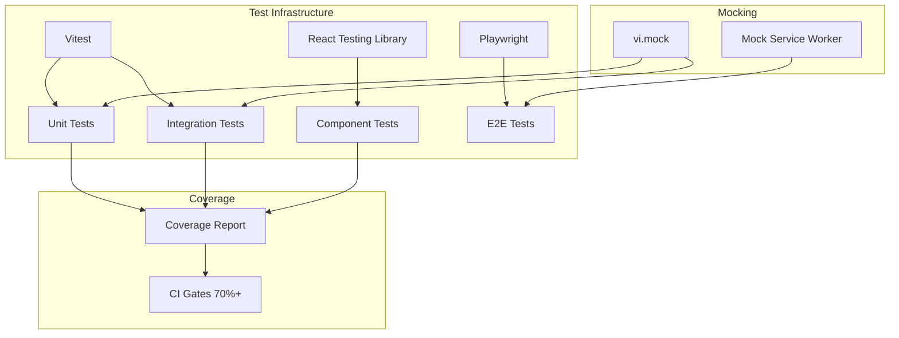

# Comprehensive Test Coverage for Epic 1 & 2

## Overview

Add comprehensive unit, integration, component, and end-to-end tests for the LinkedIn Automation MVP. The codebase already has Epic 1 (Foundation) and Epic 2 (LinkedIn Connection) implemented with 25+ passing integration tests, but significant gaps exist in test coverage.

**Current state**:
- 3 test files covering API routes: connect, webhooks, user/status
- Vitest 4.0.18 configured with globals, node environment
- Setup file with mocks for server-only, Clerk auth, env vars

**Gaps to address**:
- Missing API tests: `GET /api/health`, `GET /api/me`
- No unit tests for lib modules (`client.ts`, `auth.ts`, `webhook-verify.ts`, `webhook-handlers.ts`)
- No component tests (React Testing Library not installed)
- No E2E tests (Playwright not configured)
- No coverage reporting or CI gates

## Scope

**In scope**:
- Test infrastructure setup (RTL, Playwright, coverage)
- Unit tests for all API routes
- Unit tests for lib/unipile modules
- Component tests for critical UI components
- E2E tests for user authentication and LinkedIn connection flows
- CI integration with coverage gates
- Test documentation

**Out of scope**:
- Performance/load testing
- Visual regression testing
- Database integration tests (continue mocking)
- Tests for future epics (3-6)

## Approach

Follow existing test patterns from `__tests__/`:
- Mock hoisting pattern: `vi.mock()` before imports
- Helper factories: `createMockAuthResponse()`, `setupDbSelect()`
- Test both authenticated and unauthenticated paths
- Test edge cases: invalid inputs, timeouts, idempotency

**Key patterns to reuse** (from `apps/web/__tests__/api/webhooks/unipile.test.ts:24-48`):
- Drizzle mock with chained methods
- Clerk auth mock with full property set
- Request factory helpers

## Quick commands

```bash
# Run all tests
pnpm test

# Run tests in watch mode
pnpm test:watch

# Run tests with coverage
pnpm test:coverage

# Run E2E tests (after Playwright setup)
pnpm test:e2e

# Run specific test file
pnpm test apps/web/__tests__/api/health/route.test.ts
```

## Risks & Mitigations

| Risk | Mitigation |
|------|------------|
| Unipile OAuth testing complexity | Use mock server (MSW) for E2E; unit test handlers directly |
| Clerk session mocking drift | Use snapshot tests for mock shapes; document expected structure |
| Test flakiness in E2E | Use explicit waits; configure retries in Playwright |
| Coverage threshold too aggressive | Start at 70%, increase to 80% after stabilization |

## Architecture



## Acceptance

- [ ] All existing tests pass (25+)
- [ ] New unit tests for GET /api/health, GET /api/me
- [ ] Unit tests for lib/unipile modules (client, auth, webhook-verify, webhook-handlers)
- [ ] Component tests for LinkedInConnectionStatus, OnboardingClient, SuccessClient
- [ ] E2E tests for sign-in flow and LinkedIn connection flow
- [ ] Coverage reporting configured with 70% threshold
- [ ] Test documentation added to README and/or TESTING.md
- [ ] CI integration verifies tests pass on PR

## References

- Existing test patterns: `apps/web/__tests__/api/webhooks/unipile.test.ts`
- Vitest config: `apps/web/vitest.config.ts`
- Test setup: `apps/web/__tests__/setup.ts`
- Clerk testing docs: https://clerk.com/docs/testing/overview
- Playwright Next.js guide: https://nextjs.org/docs/app/building-your-application/testing/playwright
- React Testing Library: https://testing-library.com/docs/react-testing-library/intro
