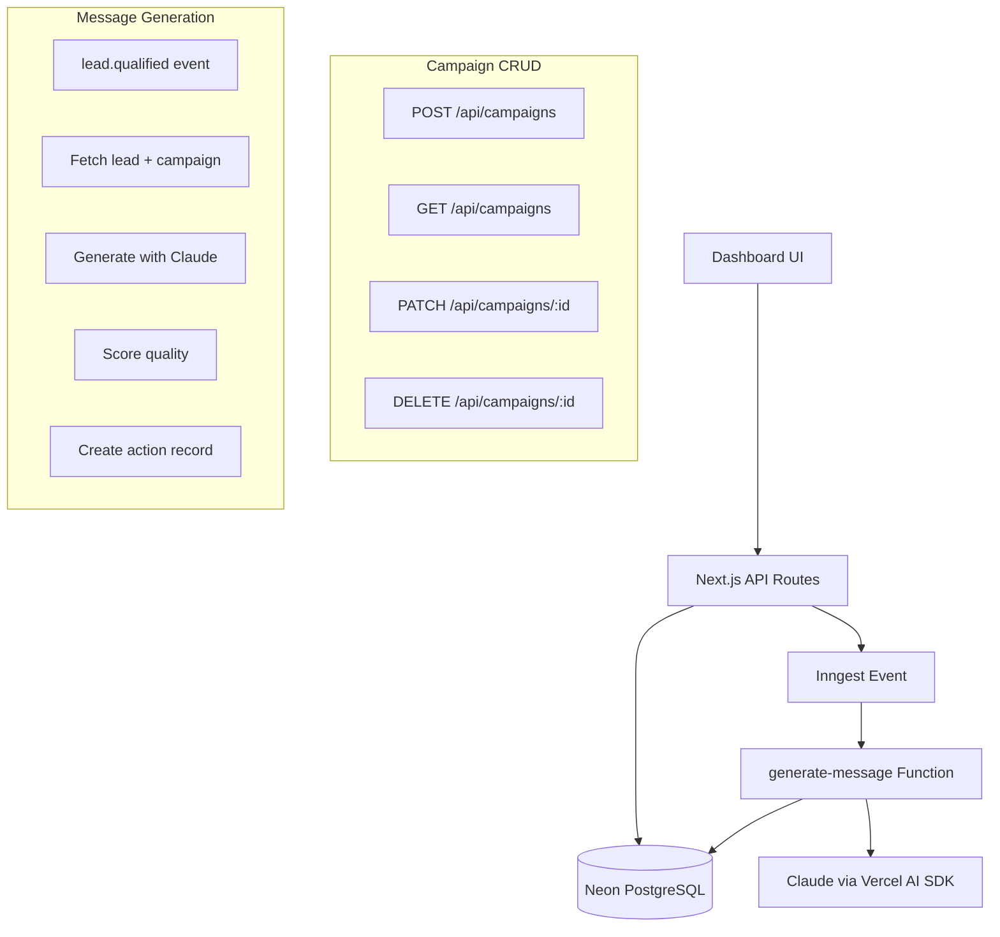

# Epic 4: Campaigns & AI Messages

## Overview

Build the campaign management system with AI-powered message generation. Users create campaigns with tone/CTA settings, assign leads, and AI generates personalized LinkedIn connection request messages. Messages are quality-scored and queued for human review (unless auto-approve enabled).

### Data Flow

```
User creates Campaign (name, tone, cta, calendarLink, autoApprove)
         ↓
User assigns Lead(s) to Campaign (single or bulk)
         ↓
Lead status updated to 'qualified' → Inngest event fires
         ↓
Inngest function: generate-message
  ├─ Fetch lead profile + campaign config
  ├─ Call Claude via Vercel AI SDK
  ├─ Score message quality (0-100)
  └─ Create action record (pending or approved if autoApprove)
         ↓
User reviews messages in Messages page
  ├─ View quality score + issues
  ├─ Edit message text (optional)
  └─ Approve → status='approved' (Epic 5 will send)
```

### Architecture



## Scope

### In Scope
- Campaign CRUD API (create, list, update, delete)
- Campaign list page with stats
- Campaign create/edit form
- Single lead assignment to campaign
- Bulk lead assignment (multi-select)
- Inngest client + function setup
- AI message generation with Claude
- Quality scoring system
- Message review page
- Edit message before approval
- Approve/reject message actions

### Out of Scope (Epic 5+)
- Sending messages via Unipile
- Rate limiting for sends
- Invitation acceptance tracking
- Follow-up sequences
- Campaign analytics dashboard

## Approach

### Phase 1: Infrastructure (Tasks 1-3)
Set up Inngest client, Vercel AI SDK, and foundational types.

### Phase 2: Campaign CRUD (Tasks 4-6)
Build API endpoints and basic campaign management.

### Phase 3: Lead Assignment (Tasks 7-8)
Implement single and bulk lead assignment with event emission.

### Phase 4: AI Generation (Tasks 9-11)
Build message generator, quality scorer, and Inngest function.

### Phase 5: Review UI (Tasks 12-14)
Campaign pages, message review, and edit functionality.

## Technical Decisions

### 1. Message Storage
**Decision**: Store messages in existing `actions` table (not separate messages table)
**Rationale**: Schema already has `message`, `qualityScore`, `usedSignals` fields. Actions represent the full lifecycle from generation to sending.

### 2. Lead-Campaign Relationship
**Decision**: Single campaign per lead (existing `campaignId` FK on leads table)
**Rationale**: Simplifies message generation and avoids duplicate outreach. Reassigning moves lead to new campaign.

### 3. Quality Scoring
**Decision**: LLM-as-judge pattern - Claude evaluates its own output
**Rationale**: More nuanced than rule-based scoring, catches edge cases. Threshold: 60 points minimum.

### 4. Idempotency Strategy
**Decision**: Check-then-insert in Inngest step + function-level idempotency key
**Rationale**: No unique constraint exists on actions(leadId, campaignId). Use Inngest CEL: `event.data.leadId + "-" + event.data.campaignId`

### 5. Non-Streaming Generation
**Decision**: Use `generateText` (not `streamText`) for background generation
**Rationale**: No real-time UI needed in Inngest functions. Complete response required for quality scoring.

## Alternatives Considered

| Option | Pros | Cons | Decision |
|--------|------|------|----------|
| Separate messages table | Clean separation | Extra joins, schema change | Rejected - use actions |
| Many-to-many lead-campaign | Flexibility | Complexity, duplicate outreach risk | Rejected - 1:1 simpler |
| Rule-based quality scoring | Predictable, fast | Misses nuance, brittle | Rejected - LLM scoring |
| Streaming generation | Progressive UI | Unnecessary for background | Rejected - batch mode |

## Risks & Mitigations

| Risk | Impact | Probability | Mitigation |
|------|--------|-------------|------------|
| Claude API rate limits | Message queue stalls | Medium | Inngest throttle: 5/min per user |
| Low quality messages | User trust eroded | Medium | 60-point threshold, human review default |
| Duplicate messages | Spam leads | Low | Idempotency key + check-before-insert |
| Schema migration needed | Delays | Low | Schema already complete |

## Non-Functional Requirements

- **Latency**: Message generation < 10s (Claude API + scoring)
- **Throughput**: Support 100 leads/campaign bulk assignment
- **Reliability**: Inngest retries (3x) with exponential backoff
- **Cost**: ~$0.003 per message (Claude Sonnet input + output tokens)

## Quick Commands

```bash
# Install new dependencies
pnpm add ai @ai-sdk/anthropic inngest

# Run Inngest dev server
npx inngest-cli@latest dev

# Generate test message (after implementation)
curl -X POST http://localhost:3000/api/campaigns \
  -H "Content-Type: application/json" \
  -d '{"name":"Test Campaign","tone":"professional","cta":"reply"}'

# Run tests
pnpm test -- campaigns
pnpm test -- message-generator
pnpm test -- quality-scorer
```

## Acceptance Criteria

### Core Functionality
- [ ] User can create campaign with name, tone, cta, calendarLink, autoApprove
- [ ] User can view list of campaigns with stats (leads, messages, approved)
- [ ] User can edit campaign settings
- [ ] User can delete campaign (cascades to actions)
- [ ] User can assign single lead to campaign
- [ ] User can bulk-assign multiple leads to campaign
- [ ] AI generates personalized message when lead status = qualified
- [ ] Message includes quality score (0-100)
- [ ] Messages below 60 score shown with warning
- [ ] User can review pending messages
- [ ] User can edit message text before approval
- [ ] User can approve message (status → approved)
- [ ] autoApprove campaigns auto-set status to approved

### Technical Requirements
- [ ] Inngest function handles lead.qualified event
- [ ] Duplicate events don't create duplicate messages (idempotency)
- [ ] AI API failures retry 3x with backoff
- [ ] Messages under 300 characters (LinkedIn limit enforced)
- [ ] Campaign stats update after message generation
- [ ] All endpoints require Clerk authentication
- [ ] All endpoints validate user owns the resource

### Testing
- [ ] Unit tests for quality scorer (≥80% coverage)
- [ ] Unit tests for prompt builder
- [ ] Integration tests for Campaign CRUD API
- [ ] Integration tests for Inngest function (mocked AI)
- [ ] E2E test: create campaign → assign lead → message appears

## Observability

### Logs
- Campaign CRUD operations (info)
- Lead assignment events (info)
- Message generation start/complete (info)
- Quality score results (info)
- AI API errors (error)

### Metrics (via Inngest dashboard)
- Messages generated per hour
- Average quality score
- Generation latency p50/p95
- Retry rate

### Alerts
- AI API error rate > 10% in 5 min
- Generation queue depth > 100

## Rollout Plan

1. **Dev**: Full implementation with test data
2. **Staging**: Deploy, test with real Inngest + mock AI
3. **Production**: Enable for single user (founder), monitor
4. **GA**: Enable for all users after 1 week stable

## Documentation Updates Needed

- [ ] Update docs/epics.md with Epic 4 completion status
- [ ] Add AI agent section to docs/architecture-decisions.md
- [ ] Create docs/campaign-api-spec.md with endpoint details
- [ ] Update README.md with AI setup instructions (ANTHROPIC_API_KEY)

## References

- Existing schema: `apps/web/lib/db/schema.ts:73-209`
- Test patterns: `docs/test-patterns-reference.md`
- Quality rules: `docs/mvp-overview.md:139-150`
- Vercel AI SDK: https://ai-sdk.dev/docs/ai-sdk-core/generating-text
- Inngest: https://www.inngest.com/docs/getting-started/nextjs-quick-start
